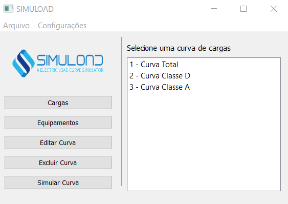
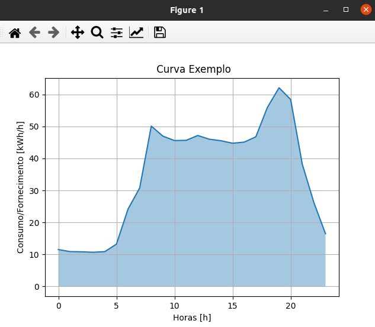

# SIMULOAD
Simuload é um projeto para criação de um simulador de curvas de cargas elétricas em uma linha de distribuição.

## Instalação
Execute os seguintes comandos (Windows 10)
```python
    >> python -m venv .venv
    >> .venv/Scripts/activate
    (.venv)>> pip install -e .

```

## Uso
Executar o main no ambiente virtual
```python
    (.venv)>> main.py
```
### Janela Principal


### Adicionando Equipamentos


### Criando Cargas


### Simulando Curvas


### Salvando os Resultados


## License

[MIT](https://github.com/caleo-hub/simuload/blob/main/LICENSE)
