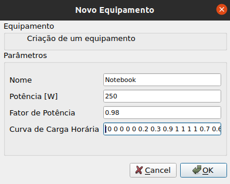
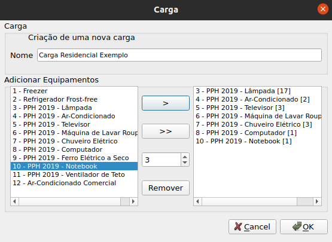
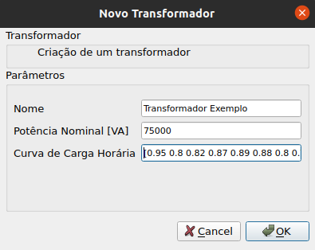
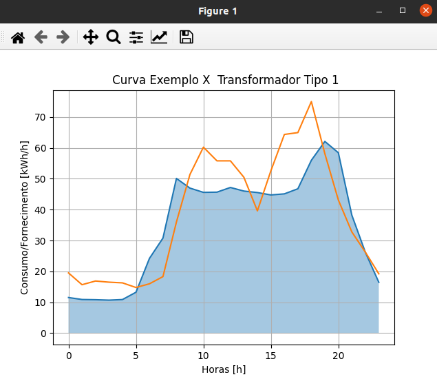

# SIMULOAD
Simuload é um projeto para criação de um simulador de curvas de cargas elétricas em uma linha de distribuição.

## Instalação Executável
Clique no botão Download à direita da página no link para o sistema operacional escolhido: 

[DOWNLOAD - Windows](https://github.com/jpcairesf/simuload/blob/main/dist/simuload_windows.rar)

[DOWNLOAD - Linux](https://github.com/jpcairesf/simuload/blob/main/dist/simuload_linux.zip)


Extraia o arquivo .ZIP e execute o arquivo Simuload para iniciar o programa. Não remova ou altere o local/configuração das pastas no diretório Simuload.

## Instalação Código Fonte
### Windows
Execute os seguintes comandos
```python
    >> python -m venv .venv
    >> .venv/Scripts/activate
    (.venv)>> pip install -e .
```

### Linux
Execute os seguintes comandos
```python
    >> python -m venv .venv
    >> source .venv/bin/activate
    (.venv)>> pip install -e .
```
### Execução
Executar o main no ambiente virtual
```python
    (.venv)>> python main.py
```

## Guia de Uso
O Simuload contém em seu banco de dados registros de transformadores com uma curva de exemplo que está próxima da curva característica de dois dos transformadores. 

Para adptar às suas condições, leia atentamente o guia de uso abaixo e configure equipamentos, cargas e curvas para atender às exigências da atividade quanto à conformidade da curva com o transformador. Exporte a curva num arquivo .CSV editável em softwares de planilha como Microsoft Excel ou Google Sheets para uma avaliação mais rigorosa dos resultados.

### Entidades
O Simuload faz uso de quatro entidades.
1. Equipamento: Representa os equipamentos que compõem uma carga em Watts [W].
2. Carga: Representa um estabelecimento consumidor em Watts [W]. Pode ser uma casa, um galpão, um mercado, iluminação pública, entre outros.
3. Curva: Representa a distribuição temporal do consumo de várias cargas. Representa o consumo numa região atendida por um transformador.
4. Transformador: Representa o fornecimento na curva característica de um transformador que atende uma região.

### Janela Principal

Simuload é uma plataforma na qual é possível utilizar os equipamentos e cargas pré-definidos no banco de dados ou customizar novas opções. Dentre os registros pré-definidos, estão os equipamentos com uso diário mapeados pelo PPH 2019 do Procel e potência mapeadas pela norma SM04.14-01.001 12ª edição da Neoenergia. Na tela prinicpal é possível visualizar os comandos de criação de componentes ou simulações de curvas.


### Adicionando Equipamentos
Adicionar, editar ou excluir um equipamento são tarefas possíveis no menu equipamentos. No campo Uso Diário, podemos definir a distribuição de uso em 24 horas do equipamento seguindo o padrão de números entre 0 e 1 nos colchetes. 
Ex.: Uso Diário: [1 1 1 1 1 1 1 1 1 1 0.5 0.5 0.5 0.5 0.5 0.5 0.5 0.5 0.5 0.5 0.2 0.2 0.2 0.2].

O campo potência [W] deve ser inserido um valor numérico que pode ser decimal utilizando um ponto no lugar da vírgula.
O fator de potência também pode ser decimal mas deve variar entre 0 e 1.




### Criando Cargas
No menu cargas é possível juntar diversas configurações de equipamentos para construir a carga desejada. Na tela de criação é possível adicionar equipamentos unitários (>) ou em lote (>>) selecionando o número desejado logo abaixo. Também é possível remover equipamentos selecionados à direita.




### Criando Transformadores
No menu transformadores é possível criar e configurar transformadores com a mesma estrutura de distribuição de 24 horas dos equipamentos no campo Fornecimento.
Ex.: Fornecimento: [1 1 1 1 1 1 1 1 1 1 0.5 0.5 0.5 0.5 0.5 0.5 0.5 0.5 0.5 0.5 0.2 0.2 0.2 0.2].

A demanda (potência do transformador) é representada em Volt-Ampère [VA].




### Criando Curvas
Na tela prinicpal é possível editar as configurações para a simulação da curva e criar curvas baseadas nas cargas existentes. Da mesma forma que a janela de novas cargas, as curvas utilizam a estrutura de adição individual (>) ou em lote (>>) das cargas, sendo possível escolher a quantidade do lote adicionado pela numeração abaixo.





## Simulação e Exportação
Na janela principal na opção "Configurações" acima, é possível escolher qual divisão em minutos será utilizada para a simulação e exportação de curvas e transformadores. 
Importante: É necessário selecionar uma curva e um transformador para utilizar essas funcionalidades. Caso a simulação ou exportação não funcione mesmo com ambos selecionados, provavelmente algum Uso Diário de equipamento ou Fornecimento de transformador foi escrito no formato errado.

### Exportação
Ao clicar em "Exportar Curva", na mesma pasta do Simuload terá uma pasta curvas. Cada simulação cria uma pasta com o nome da curva e do transformador utilizados contendo um arquivo .CSV com os dados de simulação. O nome do arquivo contém a data e horário que foi exportado.

### Simulação
Na simulação, a linha da curva é representada em azul e a do transformador em laranja. A simulação contém diversas opções utilitárias padrões do pacote Matplotlib, podendo mover a curva, dar zoom, voltar as visualizações, editar bordas e espaçamentos, configurar as características da curva e salvá-la como imagem. O eixo Y representa o Consumo/Fornecimento da curva e transformador em Kilowatt-hora [kWh] e o eixo X representa as horas [h]. Além disso, é possível selecionar o intervalo de simulação desejado entre as opções de 1 hora, 30 minutos, 15 minutos e 5 minutos, sendo a simulação de 1 hora a padrão. Abaixo temos as simulações de 30, 15 e 5 minutos, respectivamente.


