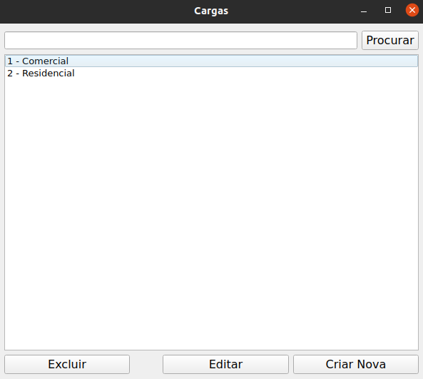

# SIMULOAD
Simuload é um projeto para criação de um simulador de curvas de cargas elétricas em uma linha de distribuição.

## Instalação
Execute os seguintes comandos (Windows 10)
```python
    >> python -m venv .venv
    >> .venv/Scripts/activate
    (.venv)>> pip install -e .

```

## Uso
Executar o main no ambiente virtual
```python
    (.venv)>> main.py
```
### Janela Principal

Simuload é uma plataforma na qual é possível utilizar os equipamentos e cargas pré-definidos no banco de dados ou customizar novas opções. Na tela prinicpal é possível visualizar os comandos de criação de componentes ou simulações de curvas.


### Adicionando Equipamentos
Adicionar, editar ou excluir um equipamento são tarefas possíveis no menu equipamentos.


### Criando Cargas
No menu cargas é possível juntar diversas configurações de equipamentos para construir a carga desejada. 




### Criando Curvas
Na tela prinicpal é possível editar as configurações para a simulação da curva e criar curvas baseadas nas cargas existentes.


### Resultados
Ao clicar em simular curva, uma janela com p gráfico da curva de carga é mostrado. É possível salvar a imagem do gráfico ou exportar um .CSV na janela principal.


## License

[MIT](https://github.com/caleo-hub/simuload/blob/main/LICENSE)
